# Pink-Hat-Scholarship

Let all that you do be done in love
 <3 Corinthians 16:14 

 # 🎀 Pink Hat Scholarship

Welcome to the **Pink Hat Scholarship**!  
This program helps aspiring cybersecurity professionals earn their certifications and build confidence in their journey.  

---

## 📊 Application Flow  

```mermaid
flowchart TD
    A[👋 Step 1: Sign Up] --> B[🎥 Step 2: Watch one of my YouTube Videos]
    B --> C[🤍 Step 3: Have Fun]
    C --> D[📝 Step 4: Tell Us Your Story]
    D --> E[💼 Step 5: Show You're Serious About Cyber]
    E --> F[🏆 Step 6: Winners Announced + Certificates Sent!]


```

### 🌸 About Pink Hat Scholars?

---
Pink Hat Scholars is more than a scholarship — it’s a movement to inspire and empower the next generation of cybersecurity professionals.
Recipients of the Pink Hat Scholarship receive a certificate of their choice to help them take their first big step toward a cybersecurity career. Along the way, they gain access to Pink Hat’s YouTube channel, where they can watch practical security awareness videosm not just to qualify for the scholarship, but to learn tips they can use every day to protect themselves and others online.
But Pink Hat Scholars is about more than technical training. Scholars are paired with Pink Hat and provided career coaching, resume reviews, encouraging support, and realworld resources to help them build confidence and succeed in a competitive field.
Pink Hat was created from a personal journey: when its founder was in college, she faced financial struggles, was one of the few women in a male dominated tech program, and even endured bullying for pursuing a career in cybersecurity. Those challenges lit a fire to create something better — a program where future cybersecurity leaders can dream big, have fun, and still be the best at what they do, while driving positive change in cyberspace and fighting back against the hackers who harm people’s lives.
At its heart, Pink Hat Scholars is about community, growth, and transformation helping others break barriers, build resilience, and become the cybersecurity professionals the world needs. Welcome to Pink Hat <3!

### 🎀 What does a Scholar get?

---

As a winner of Pink Hat Scholar

You will recieve a free voucher to an exam of your choice:
- Security +
- CYSA 
- Pentest +

As part of the scholarship experience, scholar winners will be paired with Pink Hat coach. Pink Hat coaching provide guidance on career questions, resume feedback, mental well-being support, and access to helpful resources and professional connection.

### 🎀 What are the requirements ?
---
- Must be a U.S Citizen and be a permanent resident
- Must be a current or incoming student ( college or university student ) or scholar must be seeking employment in the field of cybersecurity. Verification is not needed to reduce data retention and privacy. I trust you are applying honestly...
- Pursuing a degree or certificate in Cybersecurity
- Must demonstrate an interest in cybersecurity education, training, or employment.
- Eligible candidates are those pursuing cybersecurity studies or seeking cybersecurity career opportunities.
- Scholars must be willing to provide a selfie or professional photo upon submission, which may be used on the Pink Hat site to showcase winners in the Hall of Fame or where needed ( Example: Photos can be used in presentaions, social media sources via tiktok Youtube) Alternatily, Scholars may provide an alias image with permission from original source(a non-personal photo or graphic) to represent them if they prefer not to submit a personal photo. Example: Image of the scholars cat or gaming avatar.
- Must be 18 or over 18 years of age during the submission procces and during time of application.
- Scholars must be willing to provide personal contact information (such as phone number and email address) to stay connected with the Pink Hat mentor throughout the annual scholarship period.
- Scholars must provide truthful and accurate information. False or misleading information will result in the application being disqualified and the applicant forfeiting eligibility for future scholarships.”

### 🎀  Where to Apply?

---

Google Forums

Application Link: TBA

### 🎀 When is the deadline ?

---

Application Deadline: TBA

### 🎀  When is the next enrollment ?
---

Next Enrollment Date: TBA